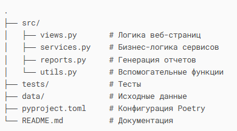

# Курсовая работа 1
## "Анализатор банковских транзакций"
#### Проект для анализа банковских транзакций из Excel-файла с генерацией отчетов в JSON и Excel форматах.


## 📌 Данные
Ссылка на Excel-файл c транзакциями:
[operations.xls](https://docs.google.com/spreadsheets/d/1yXnr282zAMcTkEhIwZFaJlPJvAeZIwvB/edit?usp=sharing&ouid=106765172812768673646&rtpof=true&sd=true)
#### Описание данных
- Дата операции — дата, когда произошла транзакция.
- Дата платежа — дата, когда был произведен платеж.
- Номер карты — последние 4 цифры номера карты.
- Статус — статус операции (например, ```OK```, ```FAILED```).
- Сумма операции — сумма транзакции в оригинальной валюте.
- Валюта операции — валюта, в которой была произведена транзакция.
- Сумма платежа — сумма транзакции в валюте счета.
- Валюта платежа — валюта счета.
- Кешбэк — размер полученного кешбэка.
- Категория — категория транзакции.
- MCC — код категории транзакции (соответствует международной классификации).
- Описание — описание транзакции.
- Бонусы (включая кешбэк) — количество полученных бонусов (включая кешбэк).
- Округление на «Инвесткопилку» — сумма, которая была округлена и переведена на «Инвесткопилку».
- Сумма операции с округлением — сумма транзакции, округленная до ближайшего целого числа.

## 📌 Функционал

### Веб-страницы
- [**Главная страница**](#веб-страницы-1) - анализ транзакций за текущий месяц:
  - Приветствие по времени суток
  - Статистика по картам (расходы, кешбэк)
  - Топ-5 транзакций
  - Курсы валют и котировки акций

### **Сервисы**
- [Поиск переводов физическим лицам](#поиск-переводов-физическим-лицам)

### Отчеты
- [Траты по категориям](#траты-по-категории)

### 🏗 Структура проекта


## Требования

### Веб-страницы
Основные функции для генерации JSON-ответов реализуйте в отдельном модуле ```views.py```.

Данные для анализа и вывода на веб-страницах — это данные с начала месяца, на который выпадает входящая дата, по входящую дату.

Если дата — ```20.05.2020```, то данные для анализа будут в диапазоне ```01.05.2020-20.05.2020```.

Валюты и акции для отображения на веб-страницах задаются в отдельном файле пользовательских настроек ```user_settings.json```.

Пример:

```
{
  "user_currencies": ["USD", "EUR"],
  "user_stocks": ["AAPL", "AMZN", "GOOGL", "MSFT", "TSLA"]
}
```

Для получения данных о валютах и ценах на акции используйте библиотеку ```requests```.

Сервисы, предоставляющие API [для курса валют](https://apilayer.com/) и [цен на акции](https://twelvedata.com/) найдете по ссылкам.

### Страница «Главная»
#json   #requests   #API    #datetime   #logging    #pytest     #pandas

Реализуйте набор функций и главную функцию, принимающую на вход строку с датой и временем в формате ```YYYY-MM-DD HH:MM:SS``` и возвращающую JSON-ответ со следующими данными:
1. Приветствие в формате ```"???"```, где ```???``` — «Доброе утро» / «Добрый день» / «Добрый вечер» / «Доброй ночи» в зависимости от текущего времени.
2. По каждой карте:
   - последние 4 цифры карты;
   - общая сумма расходов;
   - кешбэк (1 рубль на каждые 100 рублей).

3. Топ-5 транзакций по сумме платежа.
4. Курс валют.
5. Стоимость акций из S&P500.

Пример структуры JSON-ответа
```
{
  "greeting": "Добрый день",
  "cards": [
    {
      "last_digits": "5814",
      "total_spent": 1262.00,
      "cashback": 12.62
    },
    {
      "last_digits": "7512",
      "total_spent": 7.94,
      "cashback": 0.08
    }
  ],
  "top_transactions": [
    {
      "date": "21.12.2021",
      "amount": 1198.23,
      "category": "Переводы",
      "description": "Перевод Кредитная карта. ТП 10.2 RUR"
    },
    {
      "date": "20.12.2021",
      "amount": 829.00,
      "category": "Супермаркеты",
      "description": "Лента"
    },
    {
      "date": "20.12.2021",
      "amount": 421.00,
      "category": "Различные товары",
      "description": "Ozon.ru"
    },
    {
      "date": "16.12.2021",
      "amount": -14216.42,
      "category": "ЖКХ",
      "description": "ЖКУ Квартира"
    },
    {
      "date": "16.12.2021",
      "amount": 453.00,
      "category": "Бонусы",
      "description": "Кешбэк за обычные покупки"
    }
  ],
  "currency_rates": [
    {
      "currency": "USD",
      "rate": 73.21
    },
    {
      "currency": "EUR",
      "rate": 87.08
    }
  ],
  "stock_prices": [
    {
      "stock": "AAPL",
      "price": 150.12
    },
    {
      "stock": "AMZN",
      "price": 3173.18
    },
    {
      "stock": "GOOGL",
      "price": 2742.39
    },
    {
      "stock": "MSFT",
      "price": 296.71
    },
    {
      "stock": "TSLA",
      "price": 1007.08
    }
  ]
}
```
### 🛠 Сервисы
Реализуйте сервисы в отдельном модуле ```services.py```.

При реализации сервисов должны использоваться элементы функционального программирования.

#### Поиск переводов физическим лицам
#json   #logging        #pytest     #regex

Функция возвращает JSON со всеми транзакциями, которые относятся к переводам физлицам.

Категория такой транзакции — ```Переводы```, а в описании есть имя и первая буква фамилии с точкой.

Например:
- Валерий А.
- Сергей З.
- Артем П.

### Отчеты
Реализуйте отчеты в отдельном модуле ```reports.py```.

Создайте декоратор для функций-отчетов, который записывает в файл результат, который возвращает функция, формирующая отчет.

- Декоратор без параметра — записывает данные отчета в файл с названием по умолчанию (формат имени файла придумайте самостоятельно).
- Декоратор с параметром — принимает имя файла в качестве параметра.
#### Траты по категории
#json   #pandas     #logging    #pytest     #datetime

Функция принимает на вход:

- датафрейм с транзакциями,
- название категории,
- опциональную дату.
Если дата не передана, то берется текущая дата.

Функция возвращает траты по заданной категории за последние три месяца (от переданной даты).

#### Интерфейс трат по категории
``` 
def spending_by_category(transactions: pd.DataFrame,
                         category: str,
                         date: Optional[str] = None) -> pd.DataFrame:
    pass
   ```

## 🛠 Технологии
- Python 3.9+
- Pandas - обработка данных
- Requests - работа с API
- Logging - логирование операций
- Pytest - тестирование
- Poetry - управление зависимостями

## 🚀 Установка

1. Клонируйте репозиторий:
```bash
git clone https://github.com/yourusername/transaction-analyzer.git
cd transaction-analyzer
```
2. Установите зависимости:
    ```poetry install```
3. Создайте файл .env на основе шаблона:
    cp .env_template .env
4. Заполните .env своими API-ключами:
   API_KEY_FOR_CURRENCY=your_api_key
   API_KEY_FOR_STOCKS=your_api_key


### 📝 Требования
- Python 3.9+
- Установленный Poetry
- API ключи для сервисов курсов валют и котировок

### 🤝 Разработка
Создайте ветку для новой фичи:
```git checkout -b feature/new-feature```